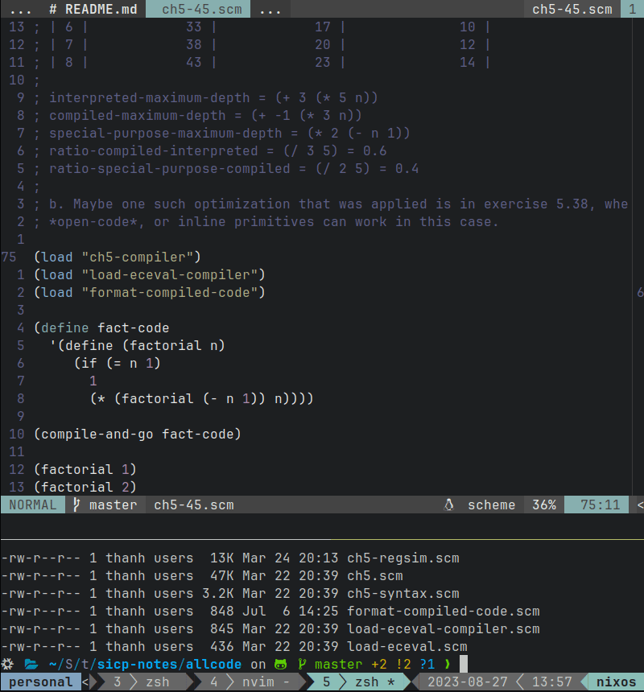

# SICP Notes

WARN: This repository needs a lot of cleaning up and maybe a renaming, as the
primary thing that I did here is the source code for every SICP exercises.

The main way to test the answer is by a REPL Driven flow in Vim/Neovim with MIT
Scheme. You'll need

- `tmux` to split the screen into two parts: *editor* and *REPL*
- `vim-slime` to send the code block from *editor* to *REPL*

```
+------------------+
|       VIM        |
|     vim-slime    +---+
|                  |   |
+------------------+   | code block
|       REPL       |   |
|                  |<--+
|                  |
+------------------+
```

`mit-scheme` should be opened within `allcode/` to make the `(load)`ing works as
expected.

Demonstration:



